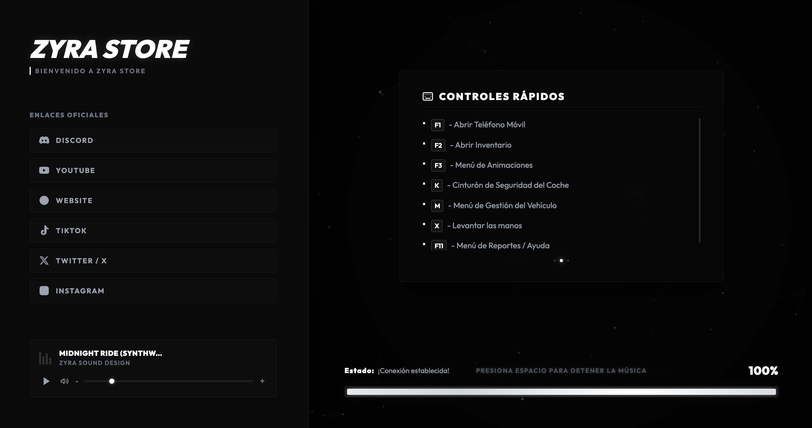
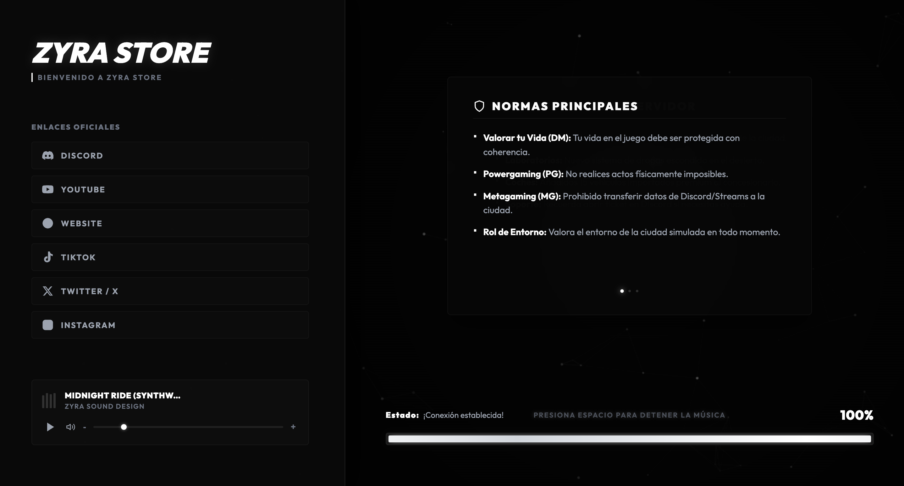
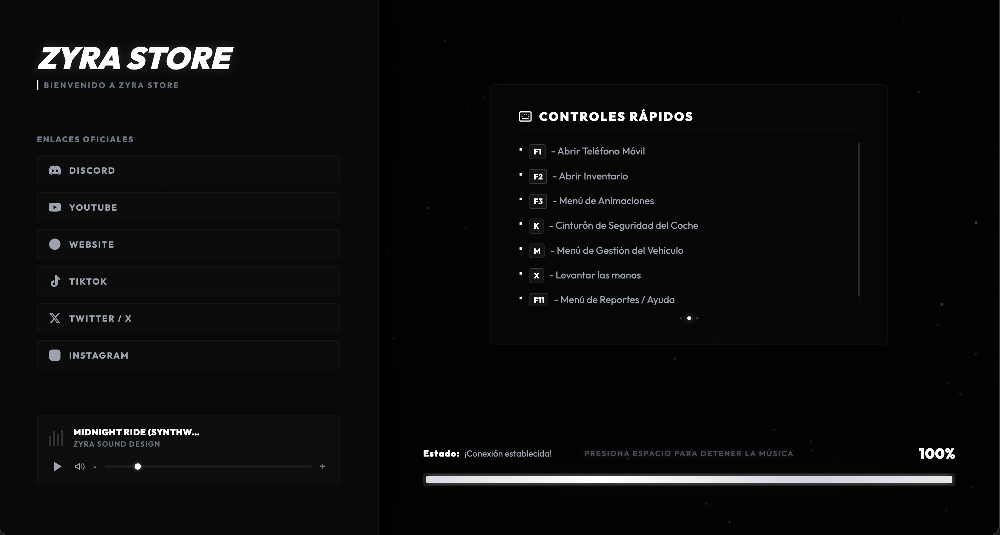

# Zyra Loading Screen

Custom animated loading screen for FiveM servers. Modern UI, smooth animations, lightweight and optimized for performance.

## Preview







## Features

- Modern, clean and fully customizable UI
- Smooth animations and transitions
- Lightweight code, optimized for zero performance impact
- Compatible with ESX, QBCore, QBox & Standalone frameworks
- Multi-language support (locales.js)
- Easy configuration via config.js

## Requirements

- FiveM server (latest recommended build)
- No additional dependencies required

## Installation

1. Download or clone this repository into your server's `resources` folder.
2. Add the following line to your `server.cfg`:

```
ensure zyra-loadingscreen
```

3. Edit `config.js` to customize texts, colors and settings to your liking.
4. Edit `locales.js` if you want to add or modify languages.
5. Restart your server or start the resource.

## Configuration

All settings can be adjusted in `config.js`, including:

- Loading screen text and branding
- Colors and theme
- Social/Discord links
- Language selection

## Support

For support, updates and more premium FiveM resources, join our Discord:

https://discord.gg/EbxjF6zTZP

Full documentation available at:

https://zyra-store.mintlify.site/introduction

## License

This resource is provided by Zyra Store. Redistribution or resale without permission is prohibited.
